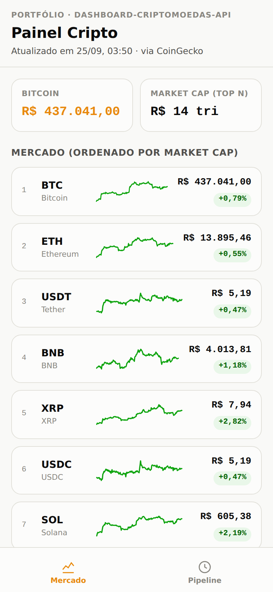
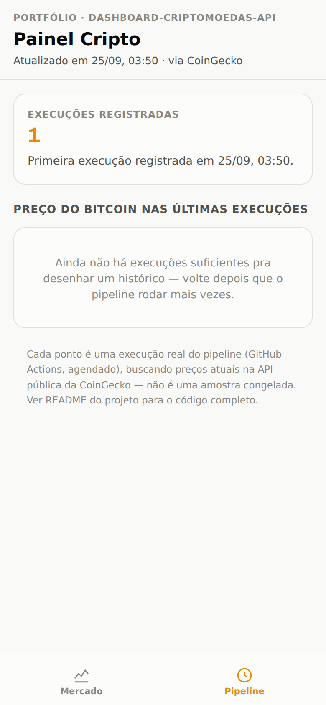

# Painel de Criptomoedas (dados via API pública)

Projeto de portfólio: um pipeline que busca preços de criptomoedas numa
API pública real (CoinGecko), processa os dados e publica um painel que
se atualiza sozinho, de hora em hora, sem qualquer intervenção manual.

Diferente do [dashboard financeiro](https://github.com/jvtdemiranda/dashboard-financeiro-PME)
(dado simulado, pensado pra mostrar tratamento de dado sujo), aqui o
foco é outro: mostrar consumo de API REST em produção, com agendamento
de verdade — o "antes" e o "depois" de cada execução ficam registrados
no próprio painel, na aba Pipeline.

**Publicado em [dashboard-criptomoedas-api.vercel.app](https://dashboard-criptomoedas-api.vercel.app)**
— atualiza sozinho a cada execução do pipeline.

<p align="center">
  
  
</p>

## Por que esse projeto

Os outros dois projetos do portfólio mostram tratamento de dado sujo e
front-end. Este mostra a terceira perna do que uma vaga de automação
geralmente pede: consumir uma API REST externa de verdade, de forma
agendada e resiliente — sem alguém precisar rodar nada manualmente pra
manter os dados em dia.

## Estrutura

```
.
├── README.md
├── requirements.txt
├── docs/               -> screenshots usados neste README
├── data/
│   ├── atual.json               -> último snapshot buscado na API (sobrescrito a cada execução)
│   └── historico_execucoes.csv  -> uma linha por execução do pipeline (preço do BTC no momento) — prova de automação real, limitado às últimas 500 execuções
├── scripts/
│   ├── buscar_dados.py          -> chama a API da CoinGecko, gera data/atual.json e atualiza o histórico
│   ├── gerar_dashboard_html.py  -> monta a versão HTML (mobile) do painel a partir dos dados
│   └── dashboard_template.html  -> esqueleto HTML/CSS/JS usado pelo script acima
└── public/
    └── index.html      -> versão HTML (mobile) do painel — é o que o Vercel publica (Root Directory = public)
```

## O pipeline

```bash
pip install -r requirements.txt

cd scripts
python buscar_dados.py          # busca as top 15 criptomoedas (por market cap) na CoinGecko, em BRL
python gerar_dashboard_html.py  # gera public/index.html a partir do snapshot + histórico
```

Dois workflows no GitHub Actions, com responsabilidades separadas de
propósito:

- **`Atualizar dados`** — o único que chama a API de verdade. Roda a
  cada hora (cron) ou manualmente. Se a CoinGecko estiver fora do ar
  numa execução, o workflow simplesmente não commita nada e tenta de
  novo na próxima janela — não trava o repositório.
- **`Check`** — roda em todo push/PR e só valida a parte determinística
  do pipeline (reconstruir `public/index.html` a partir dos dados **já
  commitados**, sem chamar a rede). Ficar refém da CoinGecko estar de
  pé pra validar uma PR de CSS, por exemplo, seria um acoplamento
  desnecessário.

## Decisões de projeto (e por quê)

- **Histórico limitado a 500 execuções**: cada execução acrescenta uma
  linha em `data/historico_execucoes.csv` (timestamp + preço do
  Bitcoin), mas o arquivo é truncado pra manter só as últimas 500 — um
  histórico real, só que sem deixar o repositório crescer pra sempre
  (rodando de hora em hora, seriam ~4.400 linhas/ano sem esse limite).
- **Sparkline de 7 dias vem direto da API**, não é histórico próprio —
  a CoinGecko já retorna 168 pontos horários por moeda
  (`sparkline_in_7d`), então não faz sentido re-coletar isso sozinho; o
  histórico próprio (aba Pipeline) serve pra provar que o *pipeline*
  roda de verdade, não pra duplicar o gráfico de preço da moeda.
- **Retry com backoff exponencial na busca**: a API gratuita da
  CoinGecko tem limite de taxa; `buscar_dados.py` tenta até 3 vezes
  antes de desistir, com 2s/4s de espera entre tentativas — repetir sem
  espera não ajuda contra rate limit (a janela de limite dura muito mais
  que o tempo entre tentativas instantâneas). Como o pipeline roda
  sozinho (sem alguém pra só rodar de novo na hora), vale a pena essa
  tentativa extra em vez de falhar na primeira instabilidade.
- **Cron em `:17`, não em `:00`**: o GitHub avisa que workflows
  agendados pra hora cheia atrasam mais, por ser o horário de maior
  carga dos runners compartilhados — um minuto excêntrico evita esse
  pico (ver bug real abaixo).
- **Preços em BRL**: a API aceita `vs_currency=brl` nativamente — evita
  ter que converter USD → BRL por conta própria (e a taxa de câmbio
  ficar desatualizada).

## O painel (HTML, mobile)

Duas abas, no mesmo estilo mobile-first de página única dos outros
projetos do portfólio (tema claro/escuro automático, sem biblioteca de
gráfico — SVG desenhado à mão):

- **Mercado** — as 15 criptomoedas rastreadas, ordenadas por market
  cap, com preço atual, variação em 24h e um sparkline dos últimos 7
  dias por moeda.
- **Pipeline** — quantas execuções já foram registradas, desde quando,
  e um gráfico do preço do Bitcoin ao longo das últimas execuções — a
  evidência visual de que o painel realmente se atualiza sozinho.

## Bugs reais encontrados no processo

Vale registrar porque são evidência de depuração real, não só "rodou sem erro":

1. **Cor do sparkline não coerente com a própria linha** — a cor de cada
   sparkline (verde/vermelho) vinha da variação de 24h, mas o gráfico
   desenha 7 dias de preço. Resultado: com dado real, 3 das 15 moedas
   rastreadas (TRX, HYPE, WBT) apareciam com a linha visivelmente
   **subindo** ao longo da semana, pintada de **vermelho**, porque só
   as últimas 24h tinham caído — contraditório pra quem olha o gráfico.
   Só apareceu comparando o sinal da variação com a inclinação real dos
   pontos do sparkline nos dados já publicados, não seria pego só lendo
   o código. Corrigido pra a cor vir do primeiro/último ponto do próprio
   sparkline, coerente com o que o gráfico de fato mostra.
2. **Cron agendado pra hora cheia atrasa** — a primeira execução
   agendada (`0 * * * *`) não disparou nem 15 minutos depois do horário
   previsto. A [documentação do GitHub](https://docs.github.com/actions/using-workflows/events-that-trigger-workflows#schedule)
   avisa que workflows agendados pra hora cheia sofrem mais atraso, por
   ser o horário de maior carga dos runners compartilhados de toda a
   plataforma — não é bug do meu código, mas é uma armadilha real de
   quem agenda `cron` sem saber disso. Corrigido trocando pra `17 * * * *`.
3. **`git push` rejeitado por corrida entre execuções** — mesmo depois
   da correção acima, a fila do GitHub ficou tão congestionada que a
   primeira execução agendada de verdade só rodou ~6h depois do horário
   previsto. Ela publicou com sucesso (`git push` ok) — só que o GitHub
   também rodou uma **segunda tentativa da mesma execução**, com
   checkout preso ao commit de quando ela tinha sido originalmente
   enfileirada; quando essa segunda tentativa tentou publicar, o remoto
   já tinha andado (pela primeira tentativa) e o push foi rejeitado
   (`! [rejected] ... fetch first`), derrubando a execução inteira com
   `conclusion: failure`. Corrigido com duas camadas: um
   `concurrency: group` no workflow (pra nunca ter duas execuções
   publicando ao mesmo tempo) e um retry com `git fetch` + `git rebase`
   no passo de commit (pra sincronizar e tentar de novo em vez de falhar
   na primeira rejeição de push).

## Stack

Python 3, requests, pandas. Sem framework de front-end (HTML/CSS/JS
puro, mesmo princípio dos outros dois projetos do portfólio).
